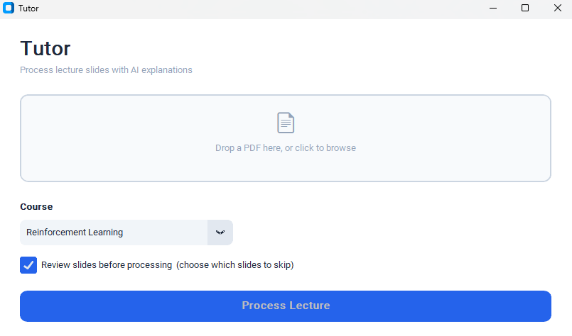
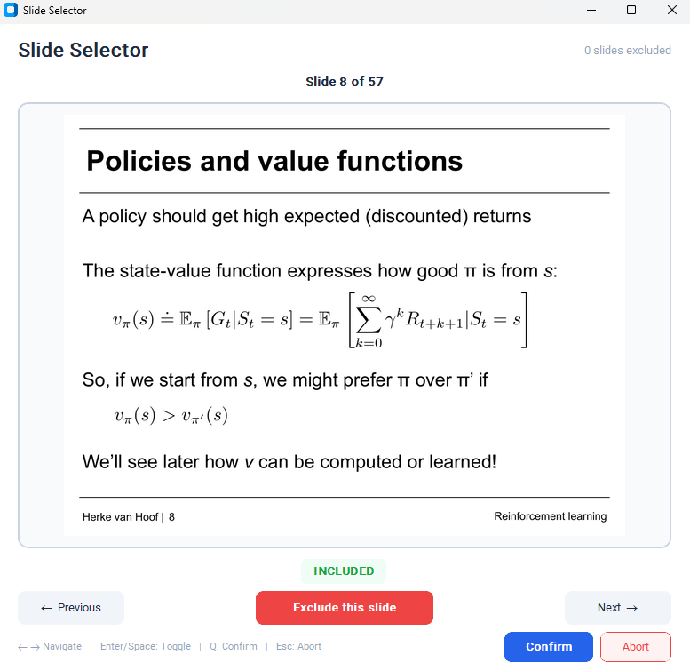

# Tutor

Automatically turn lecture slides into AI-explained Notion pages.

Drop a PDF, pick a course, and Tutor processes every slide through OpenAI, generates structured explanations with proper math formatting, then pushes everything to Notion — complete with a lecture summary and practice exam questions.

**Example output (Notion page):**
- Reinforcement Learning — Lecture 2: https://pie-snowman-06c.notion.site/Lecture2-2ff9e9b4f80d81b1a9afc7df1d264d01?source=copy_link

## How It Works

1. **Launch** — run `python main.py` to open the GUI

   

2. **Select PDF** — drag-and-drop a lecture PDF (or click to browse)
3. **Choose course + model** — pick from courses configured in your `.env`, and choose which model to use
4. **Review slides** *(optional)* — preview each slide and exclude ones you don't need explained

   

5. **Processing**

   - Slides are processed **sequentially** so the model keeps **conversation memory** across the lecture
   - For each included slide: the image is uploaded to Notion while the model generates a **reasoning-first** explanation (focused on concepts + intuition)
   - Excluded slides are still uploaded so the Notion page stays a complete source of truth (but without AI explanation)
   - Explanations are **structured** and math is rendered as **Notion equations** (KaTeX-compatible LaTeX)
6. **Result** — Tutor creates a new Notion page under your course with every slide image + explanation, then appends a **lecture summary** and **practice questions**

## Setup

### Prerequisites

- An [OpenAI](https://openai.com/) account
- An [OpenAI API key](https://platform.openai.com/api-keys)
- A [Notion](https://www.notion.com/) account
- A Notion integration*
### *Notion Integration Setup

For more detail, see the official guide: https://developers.notion.com/guides/get-started/create-a-notion-integration#getting-started

1. Go to [notion.so/profile/integrations](https://www.notion.so/profile/integrations) and click **New integration**
2. Give it a name (e.g. "UniTutor"), select your workspace, and save
3. Copy the **Internal Integration Secret** — this is your `NOTION_API_KEY`
4. Open the Notion page you want to use as a course root
5. Click **···** (top-right) → **Connections** → **Add connection** → select the integration you just created

> Repeat step 4–5 for each course page. Without the connection, the API cannot write to the page.

### Install

```bash
git clone https://github.com/MelchiorVos/LectureNotesAI.git
cd Tutor
pip install -r requirements.txt
```

### Configure

Create a `.env` file in the project root:

```env
OPENAI_API_KEY=...
NOTION_API_KEY=...

# One entry per course — the page ID is where lecture sub-pages are created
NOTION_PAGE_REINFORCEMENT_LEARNING=...
NOTION_PAGE_MACHINE_LEARNING=...
```

> **Finding your Notion page ID:** open the page in Notion — the 32-character hex string at the end is the page ID. Add that ID to your course’s `NOTION_PAGE_...` entry in `.env`.

Example:

- URL: https://www.notion.so/Information-Retrieval-1-2fd9e9b4f80d8044bc9cfa568dc6017c
- Page ID: `2fd9e9b4f80d8044bc9cfa568dc6017c`

Course names are derived from the env var names: `NOTION_PAGE_REINFORCEMENT_LEARNING` → "Reinforcement Learning" in the dropdown.

### Run

```bash
python main.py
```

## Project Structure

```
Tutor/
├── main.py                  # Entry point
├── requirements.txt
├── prompts/
│   └── system.py            # System prompt + instruction
├── frontend/
│   ├── theme.py             # Shared colors and window helpers
│   ├── launcher.py          # Launcher GUI
│   └── slide_selector.py    # Slide exclusion GUI
├── backend/
│   ├── openai_client.py     # OpenAI API calls
│   ├── notion_client.py     # Notion uploads, block building, AST conversion
│   ├── orchestrator.py      # Orchestration — ties backend together
│   └── pdf_parser.py        # PDF → images
```
  
## Customizing the Prompt

You can edit `prompts/system.py` to change how the AI explains slides. The `[COURSE_NAME]` placeholder is replaced at runtime.
